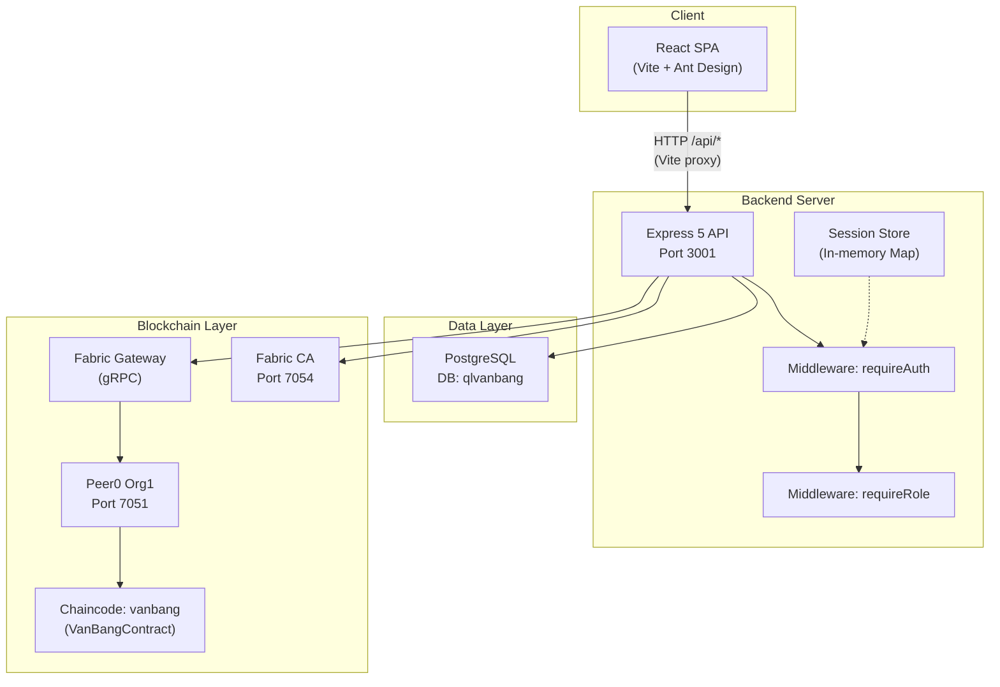
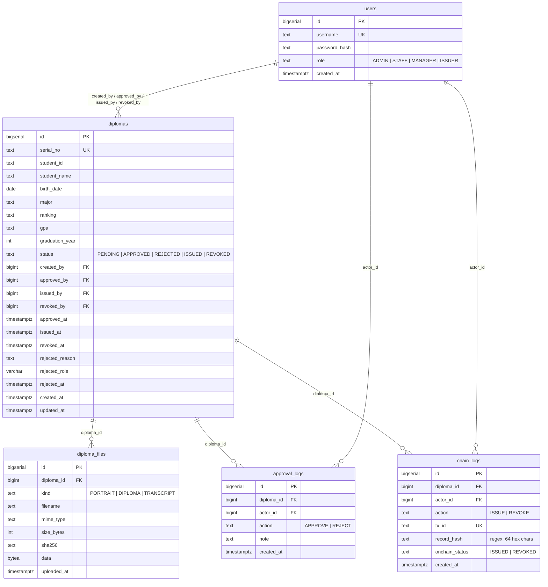
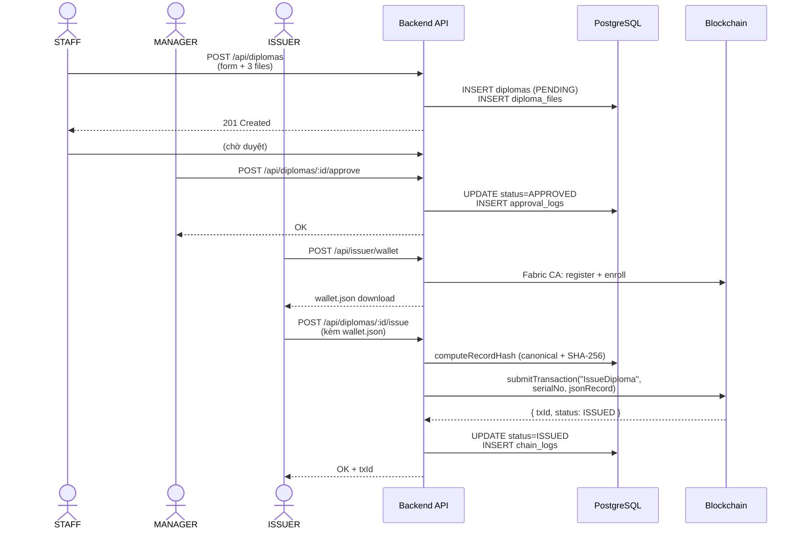
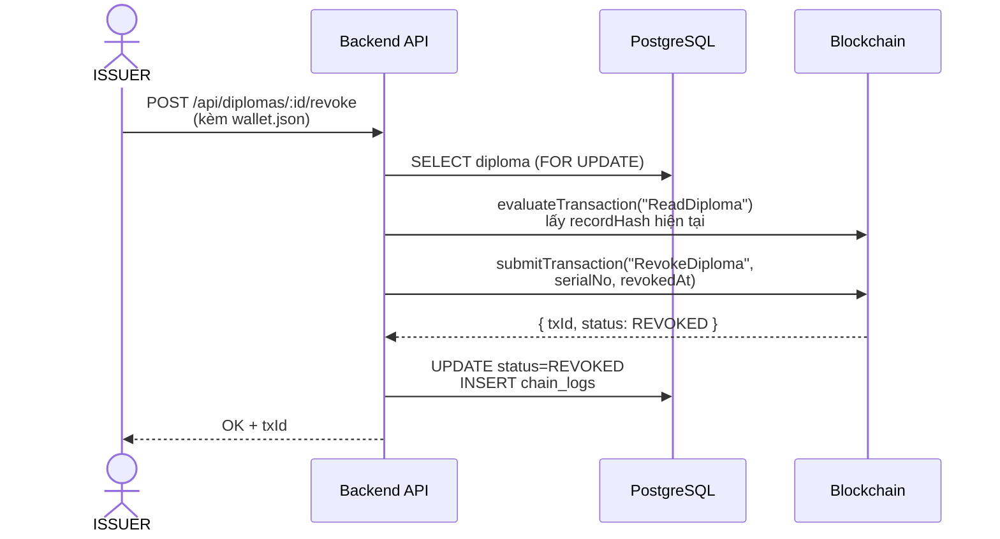
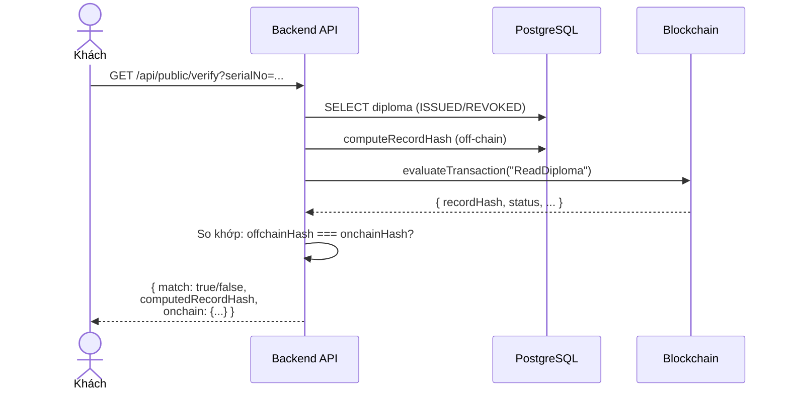

# BÁO CÁO DỰ ÁN KHÓA LUẬN

## Hệ thống Quản lý và Xác thực Văn bằng số tích hợp Blockchain (Hyperledger Fabric)

---

## 1. Tổng quan đề tài

### 1.1. Bối cảnh

Việc cấp phát và quản lý văn bằng tốt nghiệp tại các cơ sở giáo dục hiện nay phần lớn dựa trên giấy tờ truyền thống hoặc hệ thống số hoá đơn giản, dễ bị giả mạo và khó xác minh. Dự án xây dựng một hệ thống **quản lý văn bằng số** tích hợp **blockchain Hyperledger Fabric** để đảm bảo tính minh bạch, chống giả mạo và cho phép bất kỳ ai cũng có thể tra cứu/xác thực công khai.

### 1.2. Đối tượng sử dụng (Role)

Hệ thống định nghĩa 4 vai trò (`backend/schema.sql` dòng 12):

| Role | Tên tiếng Việt | Mô tả |
|------|---------------|-------|
| `ADMIN` | Quản trị viên | Quản lý tài khoản người dùng |
| `STAFF` | Nhân viên | Tạo, chỉnh sửa hồ sơ văn bằng |
| `MANAGER` | Quản lý | Duyệt / từ chối hồ sơ |
| `ISSUER` | Người cấp phát | Phát hành / thu hồi văn bằng lên blockchain |

Ngoài ra, **khách** (không đăng nhập) có thể tra cứu và xác thực văn bằng công khai tại trang `/verify`.

### 1.3. Vòng đời văn bằng

```
PENDING → APPROVED → ISSUED → REVOKED
   ↓          ↓
REJECTED   REJECTED
   ↓
PENDING (gửi lại)
```

Trạng thái được kiểm soát bằng CHECK constraint (`backend/schema.sql` dòng 29-30):
```sql
status TEXT NOT NULL DEFAULT 'PENDING'
  CHECK (status IN ('PENDING','APPROVED','REJECTED','ISSUED','REVOKED'))
```

---

## 2. Mục tiêu và phạm vi

### 2.1. Mục tiêu

1. Xây dựng quy trình số hoá cấp phát văn bằng với nhiều cấp duyệt (STAFF → MANAGER → ISSUER).
2. Ghi nhận bản ghi văn bằng lên blockchain Hyperledger Fabric, đảm bảo tính bất biến.
3. Cung cấp trang tra cứu/xác thực công khai, so khớp hash giữa off-chain (PostgreSQL) và on-chain (Fabric ledger).
4. Phân quyền chặt chẽ theo vai trò (RBAC).

### 2.2. Phạm vi

- **Trong phạm vi**: Quản lý hồ sơ văn bằng (CRUD), quy trình duyệt nhiều cấp, phát hành/thu hồi on-chain, tra cứu/xác thực công khai, quản lý người dùng.
- **Ngoài phạm vi**: Tích hợp hệ thống đào tạo bên ngoài, quản lý khoá học/điểm số, mobile app.

### 2.3. Yêu cầu chức năng

| # | Yêu cầu | Role |
|---|---------|------|
| F1 | Đăng nhập / đổi mật khẩu / đăng xuất | Tất cả |
| F2 | Tạo hồ sơ văn bằng (kèm upload 3 file) | STAFF |
| F3 | Chỉnh sửa hồ sơ PENDING/REJECTED | STAFF |
| F4 | Gửi lại hồ sơ bị từ chối | STAFF |
| F5 | Duyệt / từ chối hồ sơ PENDING | MANAGER |
| F6 | Phát hành văn bằng lên blockchain | ISSUER |
| F7 | Thu hồi văn bằng đã phát hành | ISSUER |
| F8 | Từ chối phát hành (APPROVED → REJECTED) | ISSUER |
| F9 | Tạo wallet (Fabric CA identity) | ISSUER |
| F10 | Tra cứu văn bằng công khai | Khách |
| F11 | Xác thực văn bằng (đối soát hash on-chain) | Khách |
| F12 | Quản lý tài khoản người dùng | ADMIN |

### 2.4. Yêu cầu phi chức năng

- Bảo mật: mật khẩu băm bcrypt (cost=12), token session in-memory với TTL.
- Tính toàn vẹn: hash SHA-256 cho file và bản ghi, đối soát on-chain/off-chain.
- Giao diện tiếng Việt hoàn toàn (Ant Design locale `vi_VN`).

---

## 3. Công nghệ sử dụng

### 3.1. Backend

| Thành phần | Công nghệ | Phiên bản | Ghi chú |
|-----------|----------|----------|---------|
| Runtime | Node.js | — | ESM (`"type": "module"`) |
| Framework | Express | 5.2.1 | `backend/package.json` |
| Database driver | pg (node-postgres) | 8.18.0 | |
| Password hashing | bcrypt | 6.0.0 | Cost factor = 12 |
| Fabric Gateway | @hyperledger/fabric-gateway | 1.10.1 | gRPC client |
| Fabric CA | fabric-ca-client | 2.2.20 | Tạo wallet |
| File upload | multer | 2.0.2 | Memory storage |
| HTTP client | axios | 1.13.4 | |

### 3.2. Frontend

| Thành phần | Công nghệ | Phiên bản |
|-----------|----------|----------|
| UI Library | React | 19.2.0 |
| Build tool | Vite | 7.2.4 |
| UI Framework | Ant Design (antd) | 6.2.0 |
| Routing | react-router-dom | 7.13.0 |
| HTTP client | axios | 1.13.4 |
| Icons | @ant-design/icons | 6.1.0 |

### 3.3. Blockchain

| Thành phần | Công nghệ | Phiên bản |
|-----------|----------|----------|
| Platform | Hyperledger Fabric | test-network |
| Chaincode API | fabric-contract-api | 2.5.0 |
| Chaincode Shim | fabric-shim | 2.5.0 |
| Deployment | CCAAS (Chaincode as a Service) | — |

### 3.4. Database

| Thành phần | Công nghệ |
|-----------|----------|
| RDBMS | PostgreSQL |
| Tên DB | `qlvanbang` |

> Cấu hình kết nối: `backend/.env` dòng 2:
> ```
> DATABASE_URL=postgresql://postgres:a@localhost:5432/qlvanbang
> ```

---

## 4. Kiến trúc hệ thống

### 4.1. Sơ đồ kiến trúc tổng thể



### 4.2. Cấu trúc thư mục

```
khoa-luan/
├── backend/
│   ├── src/
│   │   ├── server.js          # Entrypoint
│   │   ├── app.js             # Express app, mount routers
│   │   ├── db.js              # PostgreSQL pool
│   │   └── sessionStore.js    # In-memory session (Map)
│   ├── routes/
│   │   ├── auth.js            # Login, logout, me, change-password
│   │   ├── diplomas.js        # CRUD + approve/reject/issue/revoke
│   │   ├── public.js          # Tra cứu & xác thực công khai
│   │   ├── issuer.js          # Tạo wallet (Fabric CA)
│   │   ├── chain.js           # Đọc blockchain
│   │   └── users.js           # CRUD users (ADMIN)
│   ├── middlewares/
│   │   ├── auth.js            # requireAuth (Bearer token)
│   │   └── role.js            # requireRole(...allowed)
│   ├── services/
│   │   ├── fabricClient.js    # gRPC connection, gateway
│   │   ├── fabricDiploma.js   # chainRead/Issue/Revoke
│   │   └── recordHash.js     # Canonicalization + SHA-256
│   ├── schema.sql             # DDL + seed data
│   ├── .env                   # Biến môi trường
│   └── package.json
├── frontend/
│   ├── src/
│   │   ├── main.jsx           # Entrypoint React
│   │   ├── app/App.jsx        # ConfigProvider (Ant Design vi_VN)
│   │   ├── router/index.jsx   # React Router v7
│   │   ├── layouts/MainLayout.jsx  # Sidebar + Header
│   │   ├── components/RequireAuth.jsx  # Auth guard
│   │   ├── api/
│   │   │   ├── api.js         # Axios instance + interceptors
│   │   │   ├── diplomas.js    # API functions cho văn bằng
│   │   │   └── public.js      # API tra cứu/xác thực
│   │   ├── pages/
│   │   │   ├── LoginPage.jsx
│   │   │   ├── VerifyPage.jsx
│   │   │   ├── DiplomaListPage.jsx
│   │   │   ├── DiplomaCreatePage.jsx
│   │   │   ├── DiplomaDetailPage.jsx
│   │   │   ├── ApprovalPage.jsx
│   │   │   ├── IssuancePage.jsx
│   │   │   ├── StaffDashboardPage.jsx
│   │   │   └── AdminUsersPage.jsx
│   │   └── styles/            # CSS files
│   ├── vite.config.js         # Proxy /api → localhost:3001
│   └── package.json
├── chaincode/
│   ├── vanbang-chaincode/
│   │   ├── index.js           # Export VanBangContract
│   │   ├── lib/vanbangContract.js  # Smart contract
│   │   ├── Dockerfile
│   │   └── package.json
│   ├── DEPLOY.sh              # Deploy from scratch
│   ├── RESUME.sh              # Restart containers
│   └── RESTORE_CCAAS.sh       # Restore chaincode containers
├── network/
│   ├── install-fabric.sh
│   └── fabric-samples/test-network/  # Fabric test-network
└── docs/
    └── javascript_chaincode_guide.md
```

---

## 5. Thiết kế cơ sở dữ liệu (PostgreSQL)

> File schema: `backend/schema.sql`

### 5.1. ERD (Entity-Relationship Diagram)



### 5.2. Mô tả chi tiết các bảng

#### Bảng `users`
Quản lý tài khoản đăng nhập. Mật khẩu được băm bcrypt (cost=12).

Dữ liệu mẫu (seed) tại `backend/schema.sql` dòng 114-121:
```sql
INSERT INTO users (username, password_hash, role) VALUES
  ('admin',   '...', 'ADMIN'),    -- Admin@123
  ('staff01', '...', 'STAFF'),    -- Staff@123
  ('manager', '...', 'MANAGER'),  -- Manager@123
  ('issuer',  '...', 'ISSUER')    -- Issuer@123
ON CONFLICT (username) DO NOTHING;
```

#### Bảng `diplomas`
Bảng chính chứa thông tin văn bằng. Các cột `*_by` là FK tham chiếu tới `users(id)`.

#### Bảng `diploma_files`
Lưu trữ file ảnh/PDF dưới dạng BYTEA. Mỗi văn bằng có tối đa 3 file (UNIQUE trên `diploma_id, kind`):
- `PORTRAIT`: Ảnh chân dung
- `DIPLOMA`: File bằng tốt nghiệp
- `TRANSCRIPT`: Bảng điểm

#### Bảng `approval_logs`
Append-only, ghi lại lịch sử duyệt/từ chối.

#### Bảng `chain_logs`
Append-only, ghi lại lịch sử phát hành/thu hồi trên blockchain. Cột `record_hash` phải khớp regex 64 ký tự hex.

### 5.3. Trigger

Trigger `trg_diplomas_updated_at` tự động cập nhật `updated_at` khi UPDATE bảng `diplomas` (`schema.sql` dòng 53-64):
```sql
CREATE OR REPLACE FUNCTION set_updated_at()
RETURNS TRIGGER AS $$
BEGIN
  NEW.updated_at = now();
  RETURN NEW;
END;
$$ LANGUAGE plpgsql;
```

### 5.4. Indexes

- `idx_diplomas_student_id ON diplomas(student_id)`
- `idx_diplomas_student_name ON diplomas(lower(student_name))`
- `idx_files_diploma ON diploma_files(diploma_id)`
- `idx_approval_diploma ON approval_logs(diploma_id, created_at)`
- `idx_chain_diploma ON chain_logs(diploma_id, created_at)`

---

## 6. Thiết kế Blockchain (Hyperledger Fabric)

### 6.1. Thông tin mạng

| Thông số | Giá trị | Nguồn |
|---------|--------|-------|
| Channel | `mychannel` | `backend/.env` dòng 6 |
| Chaincode name | `vanbang` | `backend/.env` dòng 7 |
| MSP ID | `Org1MSP` | `backend/.env` dòng 10 |
| Peer endpoint | `localhost:7051` | `backend/.env` dòng 11 |
| Fabric CA URL | `https://localhost:7054` | `backend/.env` dòng 20 |
| Deployment | CCAAS (Chaincode as a Service) | `chaincode/DEPLOY.sh` |

### 6.2. Smart Contract — VanBangContract

File: `chaincode/vanbang-chaincode/lib/vanbangContract.js`

Contract kế thừa `fabric-contract-api.Contract` và cung cấp 3 hàm:

#### `IssueDiploma(ctx, serialNo, jsonRecordString)`
- Kiểm tra văn bằng chưa tồn tại (`ALREADY_EXISTS`).
- Parse JSON input, validate 8 trường bắt buộc: `studentId`, `studentName`, `birthDate`, `major`, `ranking`, `gpa`, `graduationYear`, `recordHash`.
- Validate `recordHash` là chuỗi 64 ký tự hex.
- Ghi state lên ledger với key = `serialNo`.

Đoạn code tiêu biểu (`vanbangContract.js` dòng 78-95):
```javascript
const obj = {
    serialNo,
    studentId: input.studentId,
    studentName: input.studentName,
    birthDate: input.birthDate,
    major: input.major,
    ranking: input.ranking,
    gpa: input.gpa,
    graduationYear: input.graduationYear,
    recordHash,
    status: "ISSUED",
    issuedAt,
    revokedAt: null,
    txId
};
await ctx.stub.putState(serialNo, Buffer.from(JSON.stringify(obj)));
```

#### `RevokeDiploma(ctx, serialNo, revokedAt)`
- Đọc state hiện tại, kiểm tra `status === "ISSUED"`.
- Cập nhật `status = "REVOKED"`, thêm `revokedAt` và `txId` mới.

#### `ReadDiploma(ctx, serialNo)` / `QueryDiploma(ctx, serialNo)`
- Đọc state từ ledger theo `serialNo`. Trả lỗi `NOT_FOUND` nếu không tồn tại.

### 6.3. Kết nối Fabric từ Backend

File: `backend/services/fabricClient.js`

- **`getGateway()`**: Tạo gRPC connection tới peer, dùng Admin cert/key từ `.env`. Gateway được cache (singleton).
- **`getContract()`**: Lấy contract `vanbang` trên channel `mychannel`.
- **`connectWithWallet(mspId, certificate, privateKey)`**: Tạo gateway tạm bằng wallet do client upload, dùng cho phát hành/thu hồi.

File: `backend/services/fabricDiploma.js`

| Hàm | Mô tả |
|-----|-------|
| `chainRead(serialNo)` | `evaluateTransaction("ReadDiploma", serialNo)` |
| `chainIssue(serialNo, data)` | `submitTransaction("IssueDiploma", ...)` — dùng Admin |
| `chainRevoke(serialNo, revokedAt)` | `submitTransaction("RevokeDiploma", ...)` — dùng Admin |
| `chainIssueWithWallet(...)` | Issue dùng wallet upload |
| `chainRevokeWithWallet(...)` | Revoke dùng wallet upload |

### 6.4. Tạo Wallet (Fabric CA)

File: `backend/routes/issuer.js` — endpoint `POST /api/issuer/wallet`

Quy trình:
1. Enroll registrar (admin) vào Fabric CA.
2. Register user mới với ID = `issuer_<timestamp>`.
3. Enroll user mới → lấy certificate + private key.
4. Trả về file `wallet.json` chứa `{ mspId, certificate, privateKey }`.

### 6.5. Deploy Scripts

| Script | Mục đích |
|--------|---------|
| `chaincode/DEPLOY.sh` | Deploy từ đầu: down network → up + createChannel -ca → deployCCAAS |
| `chaincode/RESUME.sh` | Restart containers sau khi tắt máy (giữ data) |
| `chaincode/RESTORE_CCAAS.sh` | Khôi phục chaincode containers bằng Docker run |

---

## 7. Thiết kế Backend (API, Auth, RBAC)

### 7.1. Entrypoint & App Setup

- **`backend/src/server.js`**: Load `.env`, import `app.js`, listen trên `PORT` (mặc định 3001).
- **`backend/src/app.js`**: Mount CORS, JSON parser, 6 router modules, error handler.

```javascript
// backend/src/app.js (trích)
app.use("/api/auth", authRouter);
app.use("/api/users", usersRouter);
app.use("/api/diplomas", diplomasRouter);
app.use("/api/chain", chainRouter);
app.use("/api/public", publicRouter);
app.use("/api/issuer", issuerRouter);
```

### 7.2. Authentication — Session Token

File: `backend/src/sessionStore.js`

- Sử dụng `Map` in-memory (không dùng JWT).
- `createSession()`: Tạo token 32 bytes hex random, lưu `userId`, `role`, `username`, `expiresAt`.
- TTL mặc định: **480 phút** (8 giờ) — cấu hình qua `SESSION_TTL_MINUTES`.
- `getSession(token)`: Kiểm tra tồn tại + hết hạn.

### 7.3. Middleware

#### `requireAuth` (`backend/middlewares/auth.js`)
- Đọc header `Authorization: Bearer <token>`.
- Gọi `getSession(token)`.
- Gắn `req.user = { id, role, username }` và `req.token`.

#### `requireRole(...allowed)` (`backend/middlewares/role.js`)
- Kiểm tra `req.user.role` có nằm trong danh sách `allowed` không.
- Trả 403 nếu không có quyền.

### 7.4. Cơ chế Hash / Canonicalization

File: `backend/services/recordHash.js`

Quy trình tạo `recordHash`:

1. **Normalize** các trường text: NFC unicode, trim, collapse whitespace.
2. **Normalize** ngày sinh → `YYYY-MM-DD`, GPA → 2 chữ số thập phân, năm → string số.
3. **Tính SHA-256** cho 3 file (PORTRAIT, DIPLOMA, TRANSCRIPT).
4. **Build canonical text** — 11 trường theo thứ tự cố định, mỗi dòng `key=value`, nối bằng `\n`:

```
serialNo=...
studentId=...
studentName=...
birthDate=YYYY-MM-DD
major=...
ranking=...
gpa=X.XX
graduationYear=YYYY
portraitSha256=...
diplomaSha256=...
transcriptSha256=...
```

5. **recordHash** = SHA-256 của canonical text (UTF-8 encoding) → 64 ký tự hex.

Hàm chính (`recordHash.js` dòng 72-107):
```javascript
export async function computeRecordHashByDiplomaId(id) {
    // Đọc diploma + 3 file từ DB
    // Tính SHA-256 cho mỗi file
    // Build canonical text
    // Return { recordHash, canonicalText }
}
```

### 7.5. File Upload

- Dùng `multer` với `memoryStorage()` (file lưu trong buffer, không ghi disk).
- Giới hạn: 5 MB cho file hồ sơ, 1 MB cho wallet.
- Chỉ cho phép: `image/jpeg`, `image/png`, `application/pdf`.
- File được lưu vào PostgreSQL dưới dạng BYTEA.

---

## 8. Thiết kế Frontend (UI, luồng màn hình)

### 8.1. Routing

File: `frontend/src/router/index.jsx`

| Path | Component | Auth? | Role |
|------|-----------|-------|------|
| `/login` | `LoginPage` | Không | — |
| `/` | → Redirect `/verify` | Không | — |
| `/verify` | `VerifyPage` | Không | Tất cả (kể cả khách) |
| `/diplomas` | `DiplomaListPage` | Có | ADMIN, STAFF, MANAGER, ISSUER |
| `/diplomas/:id` | `DiplomaDetailPage` | Có | ADMIN, STAFF, MANAGER, ISSUER |
| `/create` | `DiplomaCreatePage` | Có | STAFF |
| `/my-diplomas` | `StaffDashboardPage` | Có | STAFF |
| `/approval` | `ApprovalPage` | Có | MANAGER |
| `/issuance` | `IssuancePage` | Có | ISSUER |
| `/admin` | `AdminUsersPage` | Có | ADMIN |
| `*` | → Redirect `/verify` | — | — |

### 8.2. Auth Guard

File: `frontend/src/components/RequireAuth.jsx`

Kiểm tra `localStorage.getItem("token")`. Nếu không có → redirect `/login` với `state.from` để quay lại sau đăng nhập.

### 8.3. Sidebar Menu — Phân quyền hiển thị

File: `frontend/src/layouts/MainLayout.jsx` — hàm `getFilteredMenuItems()` (dòng 104-121):

| Role | Menu hiển thị |
|------|--------------|
| ADMIN | Tra cứu, Danh sách hồ sơ, Quản lý người dùng |
| STAFF | Tra cứu, Danh sách, Tạo hồ sơ, Hồ sơ của tôi |
| MANAGER | Tra cứu, Danh sách, Duyệt hồ sơ |
| ISSUER | Tra cứu, Danh sách, Phát hành / Thu hồi |
| GUEST | Chỉ Tra cứu |

### 8.4. Các trang chính

| Trang | File | Mô tả |
|-------|------|-------|
| LoginPage | `pages/LoginPage.jsx` | Form đăng nhập + bảng tài khoản demo |
| VerifyPage | `pages/VerifyPage.jsx` | Tra cứu (serialNo/studentId/studentName), xem chi tiết, xác thực on-chain |
| DiplomaListPage | `pages/DiplomaListPage.jsx` | Danh sách + tìm kiếm + lọc theo status |
| DiplomaCreatePage | `pages/DiplomaCreatePage.jsx` | Form tạo/sửa hồ sơ + upload 3 file |
| DiplomaDetailPage | `pages/DiplomaDetailPage.jsx` | Chi tiết + actions (duyệt/từ chối/phát hành/thu hồi) + logs |
| ApprovalPage | `pages/ApprovalPage.jsx` | Danh sách PENDING cho MANAGER duyệt |
| IssuancePage | `pages/IssuancePage.jsx` | 3 tab: Chờ phát hành / Đã phát hành / Đã thu hồi |
| StaffDashboardPage | `pages/StaffDashboardPage.jsx` | Hồ sơ PENDING và REJECTED của STAFF |
| AdminUsersPage | `pages/AdminUsersPage.jsx` | CRUD tài khoản |

### 8.5. API Layer

File: `frontend/src/api/api.js`

- Axios instance với `baseURL: "/api"` (Vite proxy → `localhost:3001`).
- Request interceptor: tự động gắn `Authorization: Bearer <token>` từ localStorage.
- Response interceptor: khi nhận 401 → xóa token + redirect `/login`.

---

## 9. Luồng nghiệp vụ chính (theo role)

### 9.1. Sequence Diagram — Luồng phát hành văn bằng



### 9.2. Sequence Diagram — Luồng thu hồi văn bằng



### 9.3. Luồng xác thực công khai



### 9.4. Luồng từ chối & gửi lại

| Bước | Hành động | API | Trạng thái |
|------|----------|-----|-----------|
| 1 | MANAGER từ chối PENDING | `POST /:id/reject` | PENDING → REJECTED |
| 2 | STAFF chỉnh sửa | `PUT /:id` | Cho phép khi REJECTED |
| 3 | STAFF gửi lại | `POST /:id/resubmit` | REJECTED → PENDING |
| 4 | ISSUER từ chối APPROVED | `POST /:id/reject-issue` | APPROVED → REJECTED |

---

## 10. Cài đặt – Triển khai – Vận hành

### 10.1. Yêu cầu hệ thống (Prerequisites)

- **Node.js** ≥ 18
- **PostgreSQL** đang chạy (database `qlvanbang`)
- **Docker** + **Docker Compose** (cho Fabric network)
- **Hyperledger Fabric binaries** (peer, orderer, configtxgen...) — cài qua `network/install-fabric.sh`

### 10.2. Cài đặt Database

```bash
# Tạo database
createdb qlvanbang

# Chạy schema + seed data
psql -d qlvanbang -f backend/schema.sql
```

### 10.3. Khởi động Fabric Network + Deploy Chaincode

```bash
# Lần đầu (deploy từ đầu):
cd khoa-luan/chaincode && bash DEPLOY.sh

# Sau khi tắt máy (restart containers, giữ data):
cd khoa-luan/chaincode && bash RESUME.sh

# Nếu chỉ thiếu chaincode containers:
cd khoa-luan/chaincode && bash RESTORE_CCAAS.sh
```

Script `DEPLOY.sh` sẽ:
1. Install chaincode dependencies (`npm install --production`).
2. Down network cũ → Up + createChannel (`-ca` để bật Fabric CA).
3. Deploy chaincode bằng CCAAS.

### 10.4. Chạy Backend

```bash
cd khoa-luan/backend
npm install
# Cấu hình .env (DATABASE_URL, Fabric paths...)
npm run dev   # nodemon src/server.js → Port 3001
```

### 10.5. Chạy Frontend

```bash
cd khoa-luan/frontend
npm install
npm run dev   # Vite dev server → Port 5173, proxy /api → 3001
```

### 10.6. Biến môi trường quan trọng (`backend/.env`)

| Biến | Giá trị mặc định | Mô tả |
|------|------------------|-------|
| `PORT` | 3001 | Port backend |
| `DATABASE_URL` | `postgresql://postgres:a@localhost:5432/qlvanbang` | Kết nối PostgreSQL |
| `SESSION_TTL_MINUTES` | 480 | Thời gian sống session (phút) |
| `FABRIC_CHANNEL` | mychannel | Tên channel |
| `FABRIC_CHAINCODE` | vanbang | Tên chaincode |
| `FABRIC_MSPID` | Org1MSP | MSP ID |
| `FABRIC_PEER_ENDPOINT` | localhost:7051 | Peer gRPC endpoint |
| `FABRIC_CA_URL` | https://localhost:7054 | Fabric CA endpoint |

---

## 11. Kiểm thử và kịch bản demo

### 11.1. Tài khoản mẫu

| Username | Password | Role |
|----------|----------|------|
| admin | Admin@123 | ADMIN |
| staff01 | Staff@123 | STAFF |
| manager | Manager@123 | MANAGER |
| issuer | Issuer@123 | ISSUER |

### 11.2. Kịch bản test theo role

#### Kịch bản 1: Quy trình phát hành hoàn chỉnh

1. **STAFF** đăng nhập → Tạo hồ sơ → Upload 3 file → Status = PENDING.
2. **MANAGER** đăng nhập → Vào "Duyệt hồ sơ" → Duyệt → Status = APPROVED.
3. **ISSUER** đăng nhập → "Tạo ví" để download `wallet.json`.
4. **ISSUER** → Vào "Phát hành / Thu hồi" → Upload wallet → Phát hành → Status = ISSUED.
5. **Khách** → Trang "Tra cứu" → Nhập số hiệu → Xác thực → Kết quả: `match: true`.

#### Kịch bản 2: Từ chối và gửi lại

1. **STAFF** tạo hồ sơ → PENDING.
2. **MANAGER** từ chối (có lý do) → REJECTED.
3. **STAFF** chỉnh sửa hồ sơ → Gửi lại → PENDING.
4. **MANAGER** duyệt lần 2 → APPROVED.

#### Kịch bản 3: Thu hồi văn bằng

1. Văn bằng đã ISSUED.
2. **ISSUER** → Thu hồi (upload wallet) → Status = REVOKED.
3. **Khách** tra cứu → Thấy trạng thái "Đã thu hồi".

#### Kịch bản 4: Quản trị

1. **ADMIN** đăng nhập → "Quản lý người dùng" → Tạo tài khoản mới.
2. Đăng nhập bằng tài khoản mới → Kiểm tra quyền.

### 11.3. Test API bằng cURL

```bash
# Login
curl -X POST http://localhost:3001/api/auth/login \
  -H "Content-Type: application/json" \
  -d '{"username":"staff01","password":"Staff@123"}'

# Lấy danh sách (cần token)
curl http://localhost:3001/api/diplomas \
  -H "Authorization: Bearer <token>"

# Tra cứu công khai
curl "http://localhost:3001/api/public/search?type=serialNo&value=VB001"

# Xác thực
curl "http://localhost:3001/api/public/verify?serialNo=VB001"
```

---

## 12. Kết luận và hướng phát triển

### 12.1. Kết quả đạt được

- Hệ thống hoạt động đầy đủ với quy trình **tạo → duyệt → phát hành → tra cứu/xác thực**.
- Tích hợp thành công Hyperledger Fabric: ghi và đọc bản ghi on-chain.
- Cơ chế **hash canonicalization** đảm bảo tính toàn vẹn dữ liệu (11 trường bao gồm SHA-256 của 3 file).
- Phân quyền RBAC chặt chẽ trên cả backend (middleware) và frontend (menu, routing).
- Giao diện tiếng Việt hoàn toàn, sử dụng Ant Design hiện đại.

### 12.2. Hạn chế / Nợ kỹ thuật

| # | Hạn chế | Chi tiết |
|---|--------|---------|
| 1 | Session in-memory | `backend/src/sessionStore.js` dùng `Map` — mất session khi restart server. Nên chuyển sang Redis hoặc DB-backed session. |
| 2 | Không có unit test | `package.json` chỉ có `"test": "echo..."`. Chưa có test tự động. |
| 3 | File lưu BYTEA | File ảnh/PDF lưu trực tiếp trong PostgreSQL (BYTEA) — không tối ưu cho file lớn. Nên dùng object storage (MinIO, S3). |
| 4 | Chưa có pagination server-side | Danh sách văn bằng giới hạn `LIMIT 50` cố định (`backend/routes/diplomas.js` dòng 289). |
| 5 | `react-router-dom` trong backend | `backend/package.json` dòng 25 có dependency `react-router-dom` — không cần thiết cho backend. |
| 6 | Chưa có audit log cho ADMIN actions | Tạo/xóa user không được ghi log. |
| 7 | Fabric CA verify=false | `backend/.env` dòng 26: `FABRIC_CA_VERIFY=false` — bỏ qua xác thực TLS trong dev. |

### 12.3. Hướng phát triển

1. **Persistent session**: Chuyển session store sang Redis.
2. **Object storage**: File upload lên MinIO/S3 thay vì BYTEA.
3. **Full-text search**: Tích hợp PostgreSQL full-text search hoặc Elasticsearch.
4. **Notification**: Thông báo real-time (WebSocket) khi hồ sơ được duyệt/từ chối.
5. **Multi-organization**: Mở rộng Fabric network với nhiều organization.
6. **Mobile app**: Phát triển ứng dụng di động cho tra cứu/xác thực.
7. **QR Code**: Gắn QR code trên văn bằng giấy, link tới trang xác thực.
8. **Testing**: Viết unit test (Jest) và integration test.

---

## Phụ lục A — Bảng API đầy đủ

### Authentication (`/api/auth`)

| Method | Path | Auth | Role | Input | Output | Status |
|--------|------|------|------|-------|--------|--------|
| POST | `/api/auth/login` | Không | — | `{ username, password }` | `{ token, user }` | 200, 400, 401 |
| GET | `/api/auth/me` | Có | Tất cả | — | `{ user }` | 200, 401 |
| PUT | `/api/auth/change-password` | Có | Tất cả | `{ oldPassword, newPassword }` | `{ message }` | 200, 400, 401 |
| POST | `/api/auth/logout` | Có | Tất cả | — | `{ ok: true }` | 200 |

### Users (`/api/users`)

| Method | Path | Auth | Role | Input | Output | Status |
|--------|------|------|------|-------|--------|--------|
| GET | `/api/users` | Có | ADMIN | — | `[{ id, username, role, created_at }]` | 200 |
| POST | `/api/users` | Có | ADMIN | `{ username, password, role }` | `{ id, username, role }` | 201, 400, 409 |

### Diplomas (`/api/diplomas`)

| Method | Path | Auth | Role | Input | Output | Status |
|--------|------|------|------|-------|--------|--------|
| POST | `/api/diplomas` | Có | STAFF | FormData (fields + 3 files) | `{ diploma, fileKinds }` | 201, 400, 409 |
| PUT | `/api/diplomas/:id` | Có | STAFF | FormData (fields + files opcionais) | `{ diploma }` | 200, 400, 404 |
| GET | `/api/diplomas` | Có | ALL (trừ khách) | `?q=&status=` | `[diplomas]` | 200 |
| GET | `/api/diplomas/:id` | Có | ALL (trừ khách) | — | `{ diploma }` | 200, 404 |
| GET | `/api/diplomas/:id/files/:kind` | Có | ALL (trừ khách) | kind: PORTRAIT/DIPLOMA/TRANSCRIPT | Binary file | 200, 400, 404 |
| POST | `/api/diplomas/:id/approve` | Có | MANAGER | `{ note? }` | `{ diploma }` | 200, 400, 404 |
| POST | `/api/diplomas/:id/reject` | Có | MANAGER | `{ note? }` | `{ diploma }` | 200, 400, 404 |
| POST | `/api/diplomas/:id/issue` | Có | ISSUER | FormData (walletFile) | `{ diploma, onchain }` | 200, 400, 404 |
| POST | `/api/diplomas/:id/revoke` | Có | ISSUER | FormData (walletFile) | `{ diploma, onchain }` | 200, 400, 404 |
| POST | `/api/diplomas/:id/reject-issue` | Có | ISSUER | `{ reason? }` | `{ diploma }` | 200, 400, 404 |
| POST | `/api/diplomas/:id/resubmit` | Có | STAFF | — | `{ diploma }` | 200, 400, 404 |
| GET | `/api/diplomas/:id/approval-logs` | Có | STAFF, MANAGER, ISSUER | — | `[logs]` | 200 |
| GET | `/api/diplomas/:id/chain-logs` | Có | STAFF, MANAGER, ISSUER | — | `[logs]` | 200 |
| GET | `/api/diplomas/:id/recordhash` | Có | STAFF, MANAGER, ISSUER | — | `{ recordHash, canonicalText }` | 200 |

### Chain (`/api/chain`)

| Method | Path | Auth | Role | Input | Output | Status |
|--------|------|------|------|-------|--------|--------|
| GET | `/api/chain/diplomas/:serialNo` | Có | STAFF, MANAGER, ISSUER | — | `{ on-chain record }` | 200, 404 |

### Public (`/api/public`) — Không cần đăng nhập

| Method | Path | Auth | Input | Output | Status |
|--------|------|------|-------|--------|--------|
| GET | `/api/public/search` | Không | `?type=serialNo/studentId/studentName&value=...` | `{ results }` | 200, 400 |
| GET | `/api/public/verify` | Không | `?serialNo=...` | `{ match, computedRecordHash, onchain }` | 200, 400, 404 |
| GET | `/api/public/diplomas/:id/files/:kind` | Không | kind: PORTRAIT/DIPLOMA/TRANSCRIPT | Binary file (chỉ ISSUED/REVOKED) | 200, 400, 404 |

### Issuer (`/api/issuer`)

| Method | Path | Auth | Role | Input | Output | Status |
|--------|------|------|------|-------|--------|--------|
| POST | `/api/issuer/wallet` | Có | ISSUER | — | Download `wallet.json` | 200, 500, 503 |

---

## Phụ lục B — Liệt kê file quan trọng và vai trò

### Backend

| File | Vai trò |
|------|--------|
| `backend/src/server.js` | Entrypoint, load env, start Express |
| `backend/src/app.js` | Mount routers, CORS, error handler |
| `backend/src/db.js` | PostgreSQL connection pool |
| `backend/src/sessionStore.js` | In-memory session management |
| `backend/middlewares/auth.js` | Token authentication middleware |
| `backend/middlewares/role.js` | RBAC authorization middleware |
| `backend/routes/auth.js` | Login, logout, me, change-password |
| `backend/routes/diplomas.js` | Toàn bộ CRUD + workflow văn bằng (690 dòng) |
| `backend/routes/public.js` | API tra cứu & xác thực công khai |
| `backend/routes/issuer.js` | Tạo wallet qua Fabric CA |
| `backend/routes/chain.js` | Đọc dữ liệu từ blockchain |
| `backend/routes/users.js` | CRUD tài khoản (ADMIN) |
| `backend/services/fabricClient.js` | gRPC connection tới Fabric peer |
| `backend/services/fabricDiploma.js` | Wrapper cho chaincode transactions |
| `backend/services/recordHash.js` | Canonicalization + SHA-256 hash |
| `backend/schema.sql` | DDL, triggers, indexes, seed data |
| `backend/.env` | Cấu hình runtime |

### Frontend

| File | Vai trò |
|------|--------|
| `frontend/src/main.jsx` | Entrypoint React, import CSS |
| `frontend/src/app/App.jsx` | ConfigProvider (Ant Design, locale vi_VN) |
| `frontend/src/router/index.jsx` | Định nghĩa routes + auth guard |
| `frontend/src/layouts/MainLayout.jsx` | Layout chính: sidebar + header + outlet |
| `frontend/src/components/RequireAuth.jsx` | Route guard kiểm tra token |
| `frontend/src/api/api.js` | Axios instance + interceptors |
| `frontend/src/api/diplomas.js` | Tất cả API functions cho văn bằng |
| `frontend/src/api/public.js` | API tra cứu/xác thực công khai |
| `frontend/src/pages/LoginPage.jsx` | Trang đăng nhập |
| `frontend/src/pages/VerifyPage.jsx` | Trang tra cứu/xác thực (30KB — lớn nhất) |
| `frontend/src/pages/DiplomaCreatePage.jsx` | Form tạo/sửa hồ sơ (23KB) |
| `frontend/src/pages/DiplomaDetailPage.jsx` | Chi tiết + actions + logs (23KB) |
| `frontend/src/pages/IssuancePage.jsx` | Phát hành / thu hồi (14KB) |
| `frontend/src/pages/StaffDashboardPage.jsx` | Dashboard STAFF (11KB) |
| `frontend/src/pages/DiplomaListPage.jsx` | Danh sách hồ sơ (9KB) |
| `frontend/src/pages/AdminUsersPage.jsx` | Quản lý người dùng (8.5KB) |
| `frontend/src/pages/ApprovalPage.jsx` | Duyệt hồ sơ (6.3KB) |
| `frontend/vite.config.js` | Vite config + proxy |

### Blockchain

| File | Vai trò |
|------|--------|
| `chaincode/vanbang-chaincode/lib/vanbangContract.js` | Smart contract chính (127 dòng) |
| `chaincode/vanbang-chaincode/index.js` | Export contract |
| `chaincode/vanbang-chaincode/package.json` | Dependencies (fabric-contract-api, fabric-shim) |
| `chaincode/vanbang-chaincode/Dockerfile` | Docker image cho CCAAS |
| `chaincode/DEPLOY.sh` | Script deploy network + chaincode |
| `chaincode/RESUME.sh` | Script restart containers |
| `chaincode/RESTORE_CCAAS.sh` | Script restore chaincode containers |

---

> **Ghi chú**: Báo cáo này được tạo tự động bằng cách quét toàn bộ mã nguồn dự án. Mọi mô tả đều dựa trên code thực tế tại thời điểm quét (2026-02-12). Các đường dẫn file và số dòng tham chiếu tới cấu trúc hiện tại của repository `khoa-luan/`.
