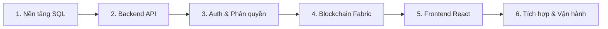
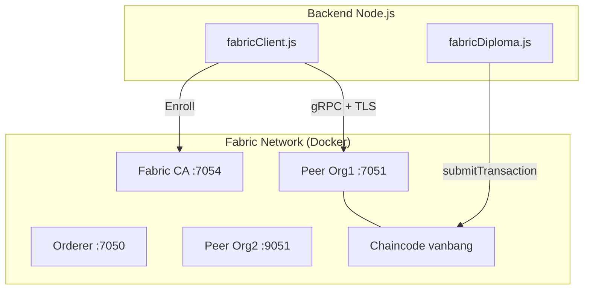
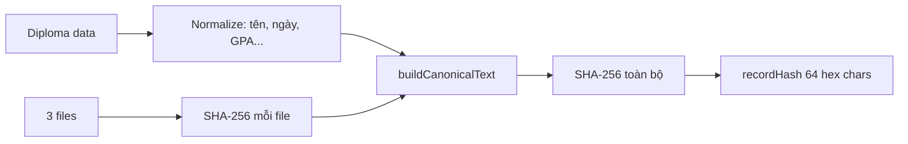
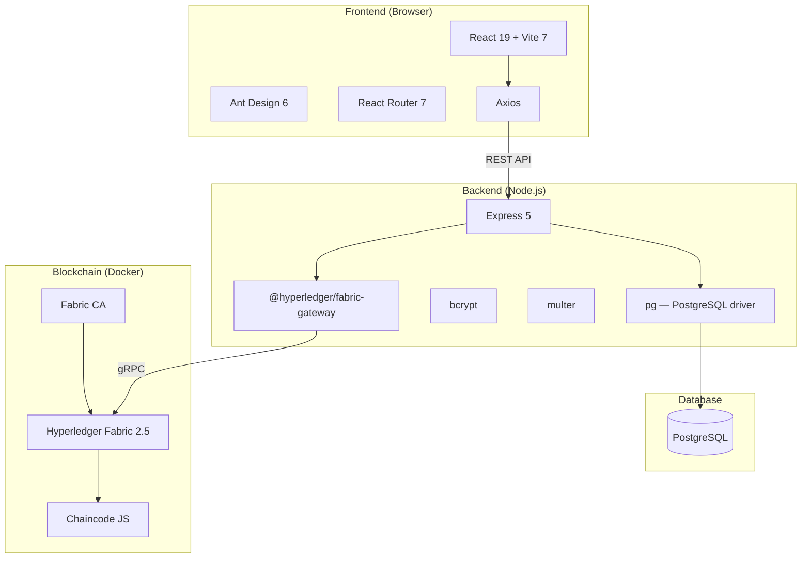

# 📚 KẾ HOẠCH HỌC TẬP — Hiểu tường tận Khóa Luận

> **Hệ thống Quản lý và Xác thực Văn bằng số tích hợp Hyperledger Fabric**
>
> Mục tiêu: đọc xong tài liệu này, bạn sẽ giải thích được **mọi dòng code** trong dự án — từ SQL đến blockchain.

---

## 🗺️ Lộ trình tổng quan (6 giai đoạn)



| # | Giai đoạn | Thời gian | File chính cần đọc |
|---|-----------|-----------|---------------------|
| 1 | PostgreSQL & Schema | 2–3 ngày | `backend/schema.sql` |
| 2 | Backend Express API | 3–4 ngày | `backend/src/`, `backend/routes/` |
| 3 | Auth, Session, Role | 1–2 ngày | `middlewares/auth.js`, `middlewares/role.js` |
| 4 | Hyperledger Fabric | 4–5 ngày | `chaincode/`, `backend/services/fabric*.js` |
| 5 | Frontend React | 3–4 ngày | `frontend/src/` |
| 6 | Tích hợp toàn bộ | 2–3 ngày | `docs/sequence-flows.md`, chạy E2E |

---

## Giai đoạn 1 — PostgreSQL & Database Schema

### 🎯 Mục tiêu
Hiểu cách dữ liệu off-chain được lưu trữ, quan hệ giữa các bảng, và tại sao chọn PostgreSQL.

### 📖 Kiến thức nền cần học

| Chủ đề | Học gì | Tài liệu gợi ý |
|--------|--------|-----------------|
| SQL cơ bản | `CREATE TABLE`, `INSERT`, `SELECT`, `UPDATE`, `JOIN` | [PostgreSQL Tutorial](https://www.postgresqltutorial.com/) |
| Kiểu dữ liệu | `BIGSERIAL`, `TEXT`, `DATE`, `INT`, `TIMESTAMPTZ`, `BYTEA` | [PG Data Types](https://www.postgresql.org/docs/current/datatype.html) |
| Constraints | `PRIMARY KEY`, `UNIQUE`, `CHECK`, `REFERENCES`, `NOT NULL` | [PG Constraints](https://www.postgresql.org/docs/current/ddl-constraints.html) |
| Index | `CREATE INDEX`, khi nào dùng, ảnh hưởng performance | [PG Indexes](https://www.postgresql.org/docs/current/indexes.html) |
| Trigger & Function | `CREATE FUNCTION`, `CREATE TRIGGER`, `BEFORE UPDATE` | [PG Triggers](https://www.postgresql.org/docs/current/trigger-definition.html) |
| Foreign Key | `REFERENCES`, `ON DELETE CASCADE` | (chung với Constraints) |

### 🔬 Đọc code — `backend/schema.sql`

Đọc **từ trên xuống**, ghi chú cho mỗi bảng:

#### Bảng `users` (dòng 8–14)
```sql
CREATE TABLE users (
  id            BIGSERIAL PRIMARY KEY,      -- tự tăng, kiểu int8
  username      TEXT NOT NULL UNIQUE,        -- đăng nhập, không trùng
  password_hash TEXT NOT NULL,               -- bcrypt hash, KHÔNG lưu plain text
  role          TEXT NOT NULL CHECK (role IN ('ADMIN','STAFF','MANAGER','ISSUER')),
  created_at    TIMESTAMPTZ NOT NULL DEFAULT now()
);
```
**Câu hỏi tự kiểm tra:**
1. Tại sao dùng `BIGSERIAL` chứ không phải `SERIAL`?
2. `CHECK (role IN (...))` làm gì? Nếu INSERT role = `'GUEST'` thì sao?
3. `TIMESTAMPTZ` khác `TIMESTAMP` ở điểm nào?

#### Bảng `diplomas` (dòng 17–47)
- **Trạng thái máy :** `PENDING → APPROVED → ISSUED` (hoặc `REJECTED` / `REVOKED`)
- 4 trường foreign key: `created_by`, `approved_by`, `issued_by`, `revoked_by` → trỏ về `users(id)`
- `CHECK (status IN (...))` — ràng buộc cấp DB, không cần validate ở app

**Câu hỏi tự kiểm tra:**
1. Vẽ sơ đồ trạng thái (state diagram) của diploma
2. Khi `UPDATE diplomas`, `updated_at` tự thay đổi — cơ chế nào? (xem trigger `trg_diplomas_updated_at`)
3. Tại sao cần INDEX trên `student_id` và `lower(student_name)`?

#### Bảng `diploma_files` (dòng 67–80)
```sql
UNIQUE (diploma_id, kind)  -- mỗi diploma chỉ có 1 file cho mỗi loại
```
- 3 loại file: `PORTRAIT`, `DIPLOMA`, `TRANSCRIPT`
- Lưu trực tiếp `BYTEA` trong DB (không dùng filesystem)
- `sha256` — dùng để tính `recordHash` sau này

**Câu hỏi tự kiểm tra:**
1. Tại sao lưu file dạng `BYTEA` thay vì lưu path?
2. Constraint `UNIQUE (diploma_id, kind)` ngăn chặn gì?

#### Bảng `approval_logs` và `chain_logs` (dòng 85–111)
- **Append-only** — chỉ INSERT, không UPDATE/DELETE → audit trail
- `approval_logs`: ghi lại ai APPROVE/REJECT
- `chain_logs`: ghi lại tx blockchain (ISSUE/REVOKE)
- `chain_logs.record_hash` có CHECK regex `'^[0-9a-f]{64}$'` — đảm bảo là SHA-256 hex

**Câu hỏi tự kiểm tra:**
1. Tại sao thiết kế bảng log riêng thay vì ghi trực tiếp vào `diplomas`?
2. `tx_id UNIQUE` đảm bảo điều gì?

### ✅ Bài tập thực hành
1. Import schema: `psql -U postgres -d qlvanbang -f backend/schema.sql`
2. Viết query: lấy tất cả diploma PENDING kèm tên người tạo
3. Viết query: đếm số diploma theo từng trạng thái
4. Viết query: lấy chain_logs gần nhất của 1 diploma

---

## Giai đoạn 2 — Backend Express API

### 🎯 Mục tiêu
Hiểu cách backend xử lý request, kết nối DB, và cấu trúc REST API.

### 📖 Kiến thức nền cần học

| Chủ đề | Học gì | Tài liệu gợi ý |
|--------|--------|-----------------|
| Node.js cơ bản | Event loop, modules ESM (`import/export`) | [Node.js Docs](https://nodejs.org/docs/latest/api/) |
| Express.js | Middleware, routing, error handling | [Express Guide](https://expressjs.com/en/guide/routing.html) |
| `pg` (node-postgres) | Pool, `pool.query()`, parameterized query | [node-postgres](https://node-postgres.com/) |
| REST API | HTTP methods, status codes, JSON response | [MDN HTTP](https://developer.mozilla.org/en-US/docs/Web/HTTP) |
| `multer` | Upload file multipart/form-data | [Multer docs](https://github.com/expressjs/multer) |
| `dotenv` | Biến môi trường `.env` | [dotenv](https://github.com/motdotla/dotenv) |
| ES Modules | `import`, `export`, `.js` extension trong Node | [Node ESM](https://nodejs.org/api/esm.html) |

### 🔬 Đọc code — theo thứ tự

#### Bước 1: Entry point — `backend/src/server.js`
- Khởi động Express trên port nào?
- Import app từ đâu?

#### Bước 2: App setup — `backend/src/app.js`
```
cors()          → cho phép frontend gọi cross-origin
express.json()  → parse JSON body
app.use("/api/auth", authRouter)   → mount route
```
**Hiểu:** mỗi `app.use("/api/xxx", router)` = nhóm endpoint theo chức năng

#### Bước 3: Database pool — `backend/src/db.js`
```javascript
import pg from 'pg';
const pool = new pg.Pool({ connectionString: process.env.DATABASE_URL });
```
**Hiểu:** Pool giữ nhiều connection sẵn, dùng lại thay vì mở/đóng liên tục

#### Bước 4: Session — `backend/src/sessionStore.js`
- Token lưu trong `Map` (in-memory)
- `SESSION_TTL_MINUTES` — token hết hạn sau bao lâu
- **Hệ quả:** restart backend → mất hết session → user phải login lại

#### Bước 5: Routes — đọc từng file

| File | Chức năng | Endpoint chính |
|------|-----------|----------------|
| `routes/auth.js` | Đăng nhập/đăng xuất | `POST /login`, `GET /me`, `PUT /change-password` |
| `routes/users.js` | Quản lý user (ADMIN) | `GET /`, `POST /` |
| `routes/diplomas.js` | **CRUD + workflow** | Tạo, sửa, duyệt, phát hành, thu hồi |
| `routes/chain.js` | Đọc on-chain | `GET /diplomas/:serialNo` |
| `routes/public.js` | Tra cứu công khai | `GET /search`, `GET /verify` |
| `routes/issuer.js` | Tạo wallet Fabric CA | `POST /wallet` |

**Cách đọc mỗi route:**
1. Xem middleware: `requireAuth`, `requireRole('...')`
2. Xem logic: query DB gì? trả response gì?
3. Xem error handling: trả status code nào?

### 🔬 Deep dive: `routes/diplomas.js` (file quan trọng nhất)

Đây là file lớn nhất, chứa toàn bộ luồng nghiệp vụ. Đọc theo thứ tự:

1. **`POST /`** — Staff tạo hồ sơ mới (multipart upload 3 file + data)
2. **`GET /`** — Liệt kê diplomas (phân trang, filter theo role)
3. **`GET /:id`** — Chi tiết 1 diploma + join chain_logs
4. **`POST /:id/approve`** — Manager duyệt → status = APPROVED
5. **`POST /:id/reject`** — Manager từ chối → status = REJECTED
6. **`POST /:id/resubmit`** — Staff gửi lại sau khi bị reject
7. **`POST /:id/issue`** — Issuer phát hành lên blockchain
8. **`POST /:id/revoke`** — Issuer thu hồi trên blockchain

**Câu hỏi tự kiểm tra:**
1. Endpoint `POST /issue` làm những gì? (gợi ý: tính hash → gọi chaincode → ghi DB)
2. Tại sao cần `multer` ở endpoint tạo diploma?
3. Endpoint nào KHÔNG cần authentication?

### ✅ Bài tập thực hành
1. Chạy `npm run dev` và test `GET /api/health`
2. Dùng `curl` hoặc Postman gọi `POST /api/auth/login`
3. Trace request: từ URL → route → middleware → handler → DB query → response

---

## Giai đoạn 3 — Authentication & Phân quyền

### 🎯 Mục tiêu
Hiểu hoàn toàn cơ chế auth token-based và RBAC (Role-Based Access Control).

### 📖 Kiến thức nền cần học

| Chủ đề | Học gì |
|--------|--------|
| Hashing mật khẩu | bcrypt, salt, work factor |
| Token auth | Bearer token, header `Authorization` |
| RBAC | Role-based access, middleware pattern |
| Middleware Express | `next()`, thứ tự thực thi |

### 🔬 Đọc code

#### `middlewares/auth.js` — `requireAuth`
Luồng xử lý:
```
Request → Lấy header Authorization → Tách "Bearer <token>"
→ Tìm token trong sessionStore → Kiểm tra hết hạn
→ Gắn req.user = { id, username, role } → next()
```

#### `middlewares/role.js` — `requireRole(...roles)`
```javascript
// Higher-order function: nhận roles, trả về middleware
export function requireRole(...roles) {
    return (req, res, next) => {
        if (!roles.includes(req.user.role)) return res.status(403)...
        next();
    };
}
```
**Dùng như:** `router.post('/approve', requireAuth, requireRole('MANAGER'), handler)`

#### Luồng login trong `routes/auth.js`:
```
1. Nhận username + password
2. Query DB lấy user
3. bcrypt.compare(password, password_hash)
4. Tạo random token (crypto.randomUUID)
5. Lưu vào sessionStore Map
6. Trả token cho client
```

**Câu hỏi tự kiểm tra:**
1. Tại sao không dùng JWT mà dùng session token in-memory?
2. Nhược điểm của session in-memory là gì? (gợi ý: restart, scale)
3. Middleware chạy theo thứ tự nào? `requireAuth` trước hay `requireRole` trước?
4. Ma trận: role nào được gọi endpoint nào?

### 📊 Ma trận phân quyền

| Endpoint | ADMIN | STAFF | MANAGER | ISSUER | Public |
|----------|:-----:|:-----:|:-------:|:------:|:------:|
| `POST /diplomas` | ❌ | ✅ | ❌ | ❌ | ❌ |
| `POST /approve` | ❌ | ❌ | ✅ | ❌ | ❌ |
| `POST /issue` | ❌ | ❌ | ❌ | ✅ | ❌ |
| `GET /users` | ✅ | ❌ | ❌ | ❌ | ❌ |
| `GET /verify` | ✅ | ✅ | ✅ | ✅ | ✅ |

---

## Giai đoạn 4 — Hyperledger Fabric & Blockchain

### 🎯 Mục tiêu
Hiểu tại sao cần blockchain, Fabric hoạt động thế nào, và chaincode của dự án làm gì.

### 📖 Kiến thức nền cần học

> [!IMPORTANT]
> Đây là phần phức tạp nhất. Dành nhiều thời gian cho lý thuyết trước khi đọc code.

| Chủ đề | Học gì | Tài liệu gợi ý |
|--------|--------|-----------------|
| Blockchain cơ bản | Ledger, block, transaction, consensus | [Hyperledger Fabric Docs](https://hyperledger-fabric.readthedocs.io/en/latest/whatis.html) |
| Permissioned vs Public | Fabric (private) vs Ethereum (public) | [Key Concepts](https://hyperledger-fabric.readthedocs.io/en/latest/key_concepts.html) |
| Fabric Architecture | Peer, Orderer, CA, Channel, MSP | [Architecture](https://hyperledger-fabric.readthedocs.io/en/latest/arch-deep-dive.html) |
| Chaincode (Smart Contract) | Contract class, ctx, stub, putState/getState | [Chaincode tutorial](https://hyperledger-fabric.readthedocs.io/en/latest/chaincode.html) |
| Fabric Gateway SDK | `@hyperledger/fabric-gateway`, connect, submit | [Gateway SDK](https://hyperledger.github.io/fabric-gateway/) |
| Fabric CA | Certificate Authority, enrollment, registration | [CA Guide](https://hyperledger-fabric-ca.readthedocs.io/) |
| gRPC | Protocol giữa client ↔ peer | (đọc tổng quan) |
| PKI & X.509 | TLS cert, private key, MSP identity | [MSP](https://hyperledger-fabric.readthedocs.io/en/latest/msp.html) |

### 🏗️ Kiến trúc Fabric trong dự án



- **Channel:** `mychannel` — kênh giao tiếp chung
- **Chaincode:** `vanbang` — smart contract xử lý văn bằng
- **2 Org:** Org1, Org2 (mô phỏng 2 tổ chức)

### 🔬 Đọc code Chaincode — `chaincode/vanbang-chaincode/lib/vanbangContract.js`

#### Hàm `IssueDiploma(ctx, serialNo, jsonRecordString)`
```
1. Parse jsonRecordString thành object
2. Kiểm tra serialNo chưa tồn tại trên ledger
3. Validate đủ field: studentId, studentName, recordHash...
4. Validate recordHash là hex 64 ký tự (SHA-256)
5. Tạo object diploma với status = "ISSUED"
6. ctx.stub.putState(serialNo, buffer) → ghi lên ledger
7. Trả về object đã ghi
```

#### Hàm `RevokeDiploma(ctx, serialNo, revokedAt)`
```
1. Đọc diploma từ ledger (getState)
2. Kiểm tra status phải là "ISSUED"
3. Cập nhật status = "REVOKED", revokedAt
4. putState lại lên ledger
```

#### Hàm `ReadDiploma(ctx, serialNo)` / `QueryDiploma`
```
1. getState(serialNo) từ ledger
2. Parse JSON và trả về
```

**Câu hỏi tự kiểm tra:**
1. `ctx.stub.putState()` — ghi dữ liệu vào đâu?
2. Tại sao chaincode không cho UPDATE sau khi đã ISSUE, chỉ cho REVOKE?
3. `recordHash` trên chain có gì khác so với dữ liệu DB?

### 🔬 Đọc code Backend Fabric Service

#### `backend/services/fabricClient.js`
3 hàm chính:
1. **`getGateway()`** — tạo gateway từ cert/key trong `.env` (server identity, cache)
2. **`getContract()`** — lấy contract `vanbang` trên channel `mychannel`
3. **`connectWithWallet(mspId, cert, key)`** — tạo gateway tạm từ wallet user upload

**Quan trọng:** Hàm `connectWithWallet` dùng khi ISSUER upload wallet.json để issue/revoke — mỗi lần tạo gateway mới, dùng xong phải `close()`.

#### `backend/services/fabricDiploma.js`
- `issueDiploma(contract, serialNo, recordData)` → `contract.submitTransaction('IssueDiploma', ...)`
- `readDiploma(contract, serialNo)` → `contract.evaluateTransaction('ReadDiploma', ...)`
- `revokeDiploma(contract, serialNo, revokedAt)` → `contract.submitTransaction('RevokeDiploma', ...)`

**Hiểu sự khác biệt:**
- `submitTransaction` = ghi (tạo transaction mới, qua orderer, ghi block)
- `evaluateTransaction` = đọc (chỉ query peer, không tạo transaction)

#### `backend/services/recordHash.js` — Cốt lõi xác thực



**Luồng tạo recordHash:**
1. Lấy data diploma từ DB (tên, mã SV, ngành...)
2. **Normalize:** trim, lowercase date, 2 decimal GPA — để đảm bảo tính **deterministic**
3. Lấy 3 file (PORTRAIT, DIPLOMA, TRANSCRIPT) → SHA-256 mỗi file
4. Ghép thành canonical text (cố định thứ tự field)
5. SHA-256 cả canonical text → `recordHash`

**Tại sao cần normalize?** Vì cùng 1 dữ liệu, nếu format khác nhau (thêm space, đổi format ngày) sẽ ra hash khác nhau → verify sai.

#### Luồng xác thực công khai (`GET /api/public/verify`)
```
1. Nhận serialNo
2. Tính recordHash từ DB (off-chain)
3. Đọc on-chain qua ReadDiploma
4. So sánh: recordHash off-chain == recordHash on-chain?
5. Trả kết quả: match/mismatch + thông tin chi tiết
```

**Câu hỏi tự kiểm tra:**
1. Nếu ai đó sửa dữ liệu trong DB (off-chain), verify sẽ ra kết quả gì?
2. Tại sao phải hash cả 3 file, không chỉ dữ liệu text?
3. Nếu recordHash không khớp, nguyên nhân có thể là gì?

### 🔬 Đọc code Deploy Scripts

#### `chaincode/DEPLOY.sh`
```bash
# 1. Install chaincode dependencies
# 2. Tắt mạng cũ: network.sh down
# 3. Dựng mạng mới + tạo channel: network.sh up createChannel -ca
# 4. Deploy chaincode: network.sh deployCC ...
```

#### `chaincode/RESUME.sh`
- Restart container sau reboot (không deploy lại)

### ✅ Bài tập thực hành
1. Chạy `bash DEPLOY.sh` — quan sát Docker containers
2. Kiểm tra: `docker ps | grep peer`
3. Đọc `.env` và map từng biến với cert path thực tế
4. Gọi `GET /api/chain/diplomas/VB-001` sau khi issue 1 diploma

---

## Giai đoạn 5 — Frontend React

### 🎯 Mục tiêu
Hiểu SPA architecture, routing, quản lý state, và cách gọi API.

### 📖 Kiến thức nền cần học

| Chủ đề | Học gì | Tài liệu gợi ý |
|--------|--------|-----------------|
| React cơ bản | Component, JSX, props, state, hooks | [React Docs](https://react.dev/learn) |
| React Hooks | `useState`, `useEffect`, `useCallback` | [Hooks](https://react.dev/reference/react/hooks) |
| React Router v7 | `createBrowserRouter`, `<Outlet>`, `useNavigate`, `useParams` | [React Router](https://reactrouter.com/) |
| Ant Design | `Table`, `Form`, `Button`, `Modal`, `message` | [Ant Design](https://ant.design) |
| Axios | Instance, interceptor, base URL | [Axios](https://axios-http.com/) |
| Vite | Dev server, proxy, build | [Vite](https://vite.dev/) |

### 🔬 Đọc code — theo thứ tự

#### 1. Entry: `main.jsx` → `router/index.jsx`
- Render vào `#root`
- Router: danh sách tất cả route → component tương ứng
- `RequireAuth` bọc route cần đăng nhập

#### 2. Layout: `layouts/MainLayout.jsx`
- Sidebar menu (thay đổi theo role)
- Header (hiện user, nút logout)
- `<Outlet />` — render trang con

#### 3. API layer: `api/api.js`
```javascript
const api = axios.create({ baseURL: '/api' });
// Interceptor: tự gắn token + xử lý 401
api.interceptors.request.use(config => {
    config.headers.Authorization = `Bearer ${token}`;
});
api.interceptors.response.use(null, error => {
    if (error.response.status === 401) → redirect /login
});
```
- `api/diplomas.js` — wrapper gọi diploma endpoints
- `api/public.js` — wrapper gọi public endpoints

#### 4. Các trang chính

| Page | Role | Chức năng |
|------|------|-----------|
| `LoginPage` | All | Đăng nhập |
| `VerifyPage` | Public | Tra cứu & xác thực văn bằng |
| `DiplomaListPage` | Auth | Danh sách tất cả diploma |
| `DiplomaCreatePage` | STAFF | Form tạo hồ sơ mới (upload 3 file) |
| `StaffDashboardPage` | STAFF | Hồ sơ mình đã tạo |
| `ApprovalPage` | MANAGER | Duyệt/từ chối hồ sơ |
| `IssuancePage` | ISSUER | Phát hành/thu hồi lên blockchain |
| `DiplomaDetailPage` | Auth | Chi tiết + lịch sử phê duyệt + chain logs |
| `AdminUsersPage` | ADMIN | Quản lý tài khoản |

#### 5. Component: `RequireAuth.jsx`
```
Kiểm tra token trong localStorage
→ Có token: render <Outlet /> (trang con)
→ Không token: redirect /login
```

**Câu hỏi tự kiểm tra:**
1. Khi user nhấn "Phát hành", flow đi như thế nào? (UI → API → Backend → Chaincode)
2. `vite.config.js` proxy `/api` đến `localhost:3001` — tại sao cần?
3. Interceptor 401 xử lý gì? Tại sao cần?
4. Menu sidebar hiện khác nhau cho mỗi role — logic ở đâu?

### ✅ Bài tập thực hành
1. Chạy `npm run dev` frontend và mở browser
2. Đăng nhập 4 tài khoản khác nhau, quan sát menu
3. Tạo 1 diploma → duyệt → phát hành — trace cả frontend và backend log
4. Mở `VerifyPage`, nhập serial number → xem kết quả verify

---

## Giai đoạn 6 — Tích hợp & Luồng End-to-End

### 🎯 Mục tiêu
Nắm toàn bộ luồng nghiệp vụ từ đầu đến cuối, kết nối mọi kiến thức lại.

### 📖 Tham khảo
- Đọc kỹ: [sequence-flows.md](file:///home/hoang/khoa-luan/docs/sequence-flows.md)
- Đọc kỹ: [runbook.md](file:///home/hoang/khoa-luan/docs/runbook.md)

### 🔬 Trace 4 luồng chính End-to-End

#### Luồng 1: Tạo hồ sơ (STAFF)
```
StaffUI → DiplomaCreatePage → api.post('/diplomas', formData)
→ Express: multer parse files → INSERT diplomas, UPSERT diploma_files
→ Response 201 → UI hiện "Thành công"
```

#### Luồng 2: Duyệt hồ sơ (MANAGER)
```
ManagerUI → ApprovalPage → api.post('/diplomas/:id/approve')
→ Express: requireRole('MANAGER') → UPDATE status='APPROVED'
→ INSERT approval_logs → Response 200
```

#### Luồng 3: Phát hành lên blockchain (ISSUER)
```
IssuerUI → IssuancePage → upload wallet.json
→ api.post('/diplomas/:id/issue', walletFile)
→ Express: parse wallet → connectWithWallet(mspId, cert, key)
→ computeRecordHash(diplomaId) → tính canonical text + SHA-256
→ fabricDiploma.issueDiploma(contract, serialNo, recordData)
→ Chaincode: IssueDiploma → putState → txId
→ UPDATE diplomas SET status='ISSUED'
→ INSERT chain_logs(ISSUE, txId, recordHash)
→ close() gateway → Response 200
```

#### Luồng 4: Xác thực công khai
```
Anyone → VerifyPage → api.get('/public/verify?serialNo=...')
→ Backend: tính recordHash off-chain
→ ReadDiploma on-chain → so sánh hash
→ Trả kết quả: offchain data + onchain data + match status
```

### 📊 Tổng hợp technology stack



### ✅ Bài tập tổng hợp cuối cùng
1. **Demo toàn bộ:** Tạo → Duyệt → Phát hành → Xác thực → Thu hồi
2. **Phá test:** Sửa 1 record trong DB, verify lại — hash có khớp không?
3. **Giải thích:** Viết 1 trang A4 giải thích tổng quan hệ thống cho người không biết IT
4. **Trả lời:** "Blockchain giải quyết vấn đề gì mà riêng PostgreSQL không làm được?"

---

## 📝 Các câu hỏi phỏng vấn / bảo vệ khóa luận

### Câu hỏi lý thuyết
1. Tại sao chọn Hyperledger Fabric mà không phải Ethereum?
2. Giải thích cơ chế xác thực tính toàn vẹn của văn bằng?
3. Permissioned blockchain khác public blockchain ở điểm nào?
4. `recordHash` được tạo như thế nào? Tại sao cần normalize dữ liệu?
5. Nếu server bị hack, dữ liệu on-chain có bị ảnh hưởng không?

### Câu hỏi kỹ thuật
6. Giải thích luồng phát hành văn bằng từ đầu đến cuối?
7. `submitTransaction` vs `evaluateTransaction` khác nhau gì?
8. Tại sao session lưu in-memory? Nhược điểm là gì?
9. Trigger `set_updated_at()` hoạt động thế nào?
10. Tại sao bảng `chain_logs` là append-only?

### Câu hỏi mở rộng
11. Nếu muốn thêm role mới (ví dụ: VIEWER), cần sửa ở đâu?
12. Nếu muốn scale lên nhiều backend server, cần thay đổi gì?
13. Làm sao thêm tính năng fulltext search tiếng Việt cho diploma?

---

## 📌 Mẹo học hiệu quả

> [!TIP]
> 1. **Đọc code với `console.log`**: thêm log vào function, chạy thử, xem output
> 2. **Trace request**: từ browser DevTools → Network tab → xem request/response
> 3. **Không cần nhớ hết**: hiểu flow và biết tìm ở đâu quan trọng hơn
> 4. **Vẽ sơ đồ**: mỗi khi đọc xong 1 phần, vẽ lại bằng tay — giúp nhớ lâu
> 5. **Đặt câu hỏi "Tại sao?"**: mỗi dòng code, hỏi "tại sao viết thế này?"
