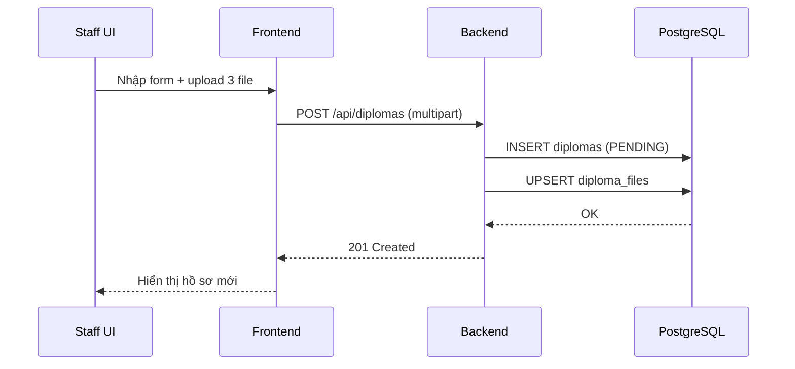
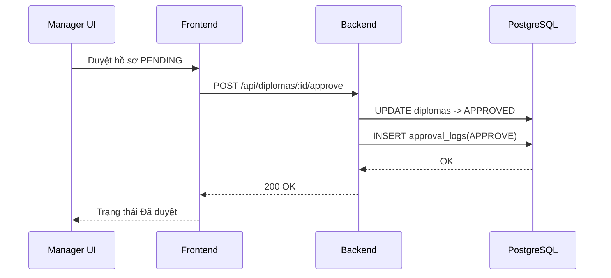
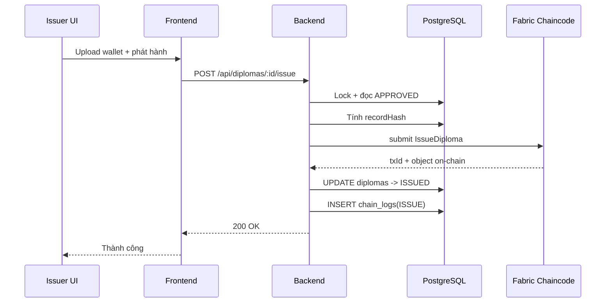
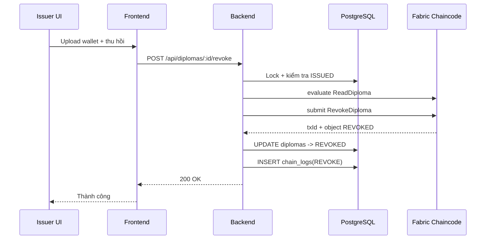

# Sequence Flows

## 1. Tạo hồ sơ (STAFF)

```mermaid
sequenceDiagram
    participant U as Staff UI
    participant FE as Frontend
    participant BE as Backend
    participant DB as PostgreSQL

    U->>FE: Nhập form + upload 3 file
    FE->>BE: POST /api/diplomas (multipart)
    BE->>DB: INSERT diplomas (PENDING)
    BE->>DB: UPSERT diploma_files
    DB-->>BE: OK
    BE-->>FE: 201 Created
    FE-->>U: Hiển thị hồ sơ mới
```

## 2. Duyệt hồ sơ (MANAGER)

```mermaid
sequenceDiagram
    participant U as Manager UI
    participant FE as Frontend
    participant BE as Backend
    participant DB as PostgreSQL

    U->>FE: Duyệt hồ sơ PENDING
    FE->>BE: POST /api/diplomas/:id/approve
    BE->>DB: UPDATE diplomas -> APPROVED
    BE->>DB: INSERT approval_logs(APPROVE)
    DB-->>BE: OK
    BE-->>FE: 200 OK
    FE-->>U: Trạng thái Đã duyệt
```

## 3. Phát hành (ISSUER)

```mermaid
sequenceDiagram
    participant U as Issuer UI
    participant FE as Frontend
    participant BE as Backend
    participant DB as PostgreSQL
    participant BC as Fabric Chaincode

    U->>FE: Upload wallet + phát hành
    FE->>BE: POST /api/diplomas/:id/issue
    BE->>DB: Lock + đọc APPROVED
    BE->>DB: Tính recordHash
    BE->>BC: submit IssueDiploma
    BC-->>BE: txId + object on-chain
    BE->>DB: UPDATE diplomas -> ISSUED
    BE->>DB: INSERT chain_logs(ISSUE)
    BE-->>FE: 200 OK
    FE-->>U: Thành công
```

## 4. Thu hồi (ISSUER)

```mermaid
sequenceDiagram
    participant U as Issuer UI
    participant FE as Frontend
    participant BE as Backend
    participant DB as PostgreSQL
    participant BC as Fabric Chaincode

    U->>FE: Upload wallet + thu hồi
    FE->>BE: POST /api/diplomas/:id/revoke
    BE->>DB: Lock + kiểm tra ISSUED
    BE->>BC: evaluate ReadDiploma
    BE->>BC: submit RevokeDiploma
    BC-->>BE: txId + object REVOKED
    BE->>DB: UPDATE diplomas -> REVOKED
    BE->>DB: INSERT chain_logs(REVOKE)
    BE-->>FE: 200 OK
    FE-->>U: Thành công
```
